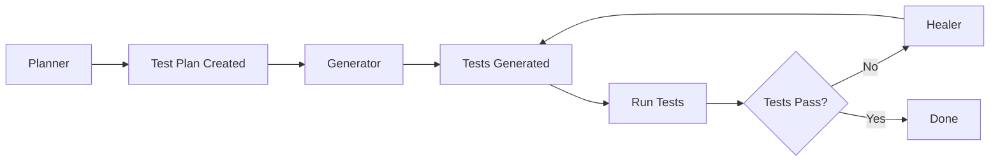

# 🤖 AI-Powered Test Development with MCP and Claude Agents

## What is MCP?

**MCP (Model Context Protocol)** is a standardized protocol that allows AI assistants like Claude to interact with external tools and services. In this project, MCP enables Claude to directly interact with Playwright tests through specialized agents.

## Available Claude Agents

This project is configured with three specialized Playwright agents that assist with test development:

### 1. 🗺️ **Planner Agent** - Test Planning

The Planner agent helps you create comprehensive test plans for your web application.

**When to use:**
- Starting a new testing project
- Planning test coverage for new features
- Creating a structured test suite
- Documenting test scenarios before implementation

**How to use:**

In VS Code with Claude Code:
1. Open the Claude chat panel
2. Click the "Build with agent mode" button
3. Select **"planner"** from the agent options
4. Navigate to your target URL in the browser that opens
5. Explore the application - the agent will observe interactions
6. The agent will generate a comprehensive test plan document

Example command:
```
I need to create a test plan for the authentication flow at https://www.saucedemo.com
```

**What it generates:**
- Test suite structure organized by features
- Individual test cases with steps and expected results
- Seed files for page setup
- Recommended file structure for tests

---

### 2. 🧪 **Generator Agent** - Test Code Generation

The Generator agent converts test plans into executable Playwright test code.

**When to use:**
- After creating a test plan with the Planner agent
- Converting manual test cases to automated tests
- Generating new test files from specifications
- Implementing tests for new features

**How to use:**

In VS Code with Claude Code:
1. Open the Claude chat panel
2. Click the "Build with agent mode" button
3. Select **"generator"** from the agent options
4. Reference your test plan file (e.g., `specs/test.plan.md`)

Example command:
```
Generate tests from the test plan in specs/test.plan.md
```

**What it generates:**
- Complete Playwright test files (.spec.ts)
- Proper test structure with describe blocks
- Page interactions using Playwright locators
- Assertions and verifications
- Test setup and teardown

**Generated code includes:**
- Type-safe TypeScript code
- Best practice locator strategies
- Proper async/await patterns
- Descriptive test names and comments

---

### 3. 🔧 **Healer Agent** - Test Debugging and Fixing

The Healer agent debugs and fixes failing Playwright tests.

**When to use:**
- Tests are failing after application changes
- Flaky tests that pass/fail intermittently
- Locator errors or element not found issues
- Timing issues or race conditions
- After UI updates that break existing tests

**How to use:**

In VS Code with Claude Code:
1. Open the Claude chat panel
2. Click the "Build with agent mode" button
3. Select **"healer"** from the agent options
4. Specify the failing test file or test name

Example commands:
```
Fix the failing test in tests/01-checkout.spec.ts
```
```
Debug why the cart management test is flaky
```
```
The login test is failing - can you fix it?
```

**What it does:**
- Runs the failing test to observe the failure
- Analyzes error messages and stack traces
- Inspects the application state during failure
- Takes snapshots to understand UI state
- Identifies root cause (wrong locator, timing, logic error)
- Fixes the test code
- Re-runs to verify the fix

**Common fixes it applies:**
- Updates broken selectors/locators
- Adds proper wait conditions
- Fixes race conditions
- Corrects assertion logic
- Updates expected values after UI changes
- Improves test stability

---

## Setting Up MCP Agents

### Configuration File

The project includes a `.mcp.json` configuration file that defines the Playwright MCP server:

```json
{
  "mcpServers": {
    "playwright-test": {
      "command": "npx",
      "args": [
        "playwright",
        "run-test-mcp-server"
      ]
    }
  }
}
```

**Note**: The `run-test-mcp-server` command is built into Playwright 1.57.0+ as a hidden command. It provides the MCP server that exposes browser automation tools to Claude agents.

### Verifying Agent Setup

1. Check that `.mcp.json` exists in your project root
2. Ensure Playwright is installed: `npm install`
3. Open VS Code with Claude Code extension
4. The agents should appear in the "Build with agent mode" menu

---

## Typical Workflow with Claude Agents

### End-to-End Test Development Flow:



**Step-by-step workflow:**

1. **Plan** - Use the **Planner** agent
   ```
   Create a test plan for the checkout flow
   ```

2. **Generate** - Use the **Generator** agent
   ```
   Generate tests from specs/checkout.plan.md
   ```

3. **Run** - Execute the tests
   ```bash
   npx playwright test tests/checkout.spec.ts
   ```

4. **Fix** (if needed) - Use the **Healer** agent
   ```
   The checkout test is failing at step 5 - please fix it
   ```

5. **Maintain** - Use **Healer** when UI changes break tests
   ```
   Fix all failing tests after the UI update
   ```

---

## Best Practices with Claude Agents

### 1. **Start with Planning**
- Always use the Planner agent before writing tests
- Creates better test coverage
- Documents test intent
- Makes test maintenance easier

### 2. **Iterate with Healer**
- Don't manually fix every failing test
- Let Healer analyze and fix issues
- Review the fixes to learn patterns
- Healer can batch-fix multiple related failures

### 3. **Keep Test Plans Updated**
- Update test plans when features change
- Regenerate tests from updated plans
- Test plans serve as living documentation

### 4. **Combine with Traditional Development**
- Use agents for repetitive tasks
- Write custom helpers and utilities manually
- Agents integrate with your existing code
- Page Object Models work great with generated tests

### 5. **Version Control**
- Commit generated test plans to Git
- Review agent-generated code before committing
- Track changes to understand test evolution
- Use meaningful commit messages for generated tests

---

## Troubleshooting MCP Agents

### Agent Not Showing in VS Code
```bash
# Verify .mcp.json exists
cat .mcp.json

# Reinstall Playwright
npm install

# Restart VS Code
```

### Agent Fails to Start
```bash
# Check Playwright installation
npx playwright --version

# Install browsers
npx playwright install

# Check Node.js version (requires 18+)
node --version
```

### Browser Doesn't Open for Planner
```bash
# Install Chromium browser specifically
npx playwright install chromium

# Try running in headed mode
npx playwright test --headed
```

### Generated Tests Don't Match Expected Format
- Update your test plan to be more specific
- Provide example test code for the agent to follow
- Use consistent naming conventions in test plans

---

## Example: Using All Three Agents Together

Let's walk through creating tests for a new "Product Reviews" feature:

### Step 1: Create Test Plan with Planner
```
I need a test plan for the product reviews feature.
Users should be able to:
- View existing reviews
- Add a new review with rating and comment
- Edit their own reviews
- Delete their own reviews
```

**Planner Output:** `specs/product-reviews.plan.md`

### Step 2: Generate Tests with Generator
```
Generate tests from specs/product-reviews.plan.md
Save them to tests/product-reviews/
```

**Generator Output:**
- `tests/product-reviews/view-reviews.spec.ts`
- `tests/product-reviews/add-review.spec.ts`
- `tests/product-reviews/edit-review.spec.ts`
- `tests/product-reviews/delete-review.spec.ts`

### Step 3: Run Tests
```bash
npx playwright test tests/product-reviews/
```

### Step 4: Fix Issues with Healer (if needed)
```
The add-review test is failing because the submit button locator is wrong.
Please fix it.
```

**Healer Output:** Updated `tests/product-reviews/add-review.spec.ts` with correct locator

---

**For the main project documentation, see [README.md](README.md)**
